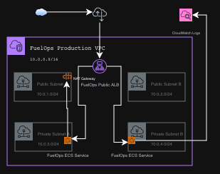

# FuelOps ECS Platform

Production-style AWS ECS Fargate platform for a sample application, built with Terraform to demonstrate practical cloud engineering skills across networking, load balancing, container orchestration, IAM, logging, and infrastructure as code.

## Overview

This project uses Terraform to deploy a container platform on AWS. The application runs on ECS Fargate behind an Application Load Balancer, with networking, security groups, IAM permissions, and CloudWatch logging configured as part of the infrastructure.

## Architecture Diagram

The FuelOps ECS Platform uses a production-style AWS architecture designed around security, scalability, and operational visibility.

Key architectural principles include:
- Public/private subnet separation
- Internet-facing Application Load Balancer (ALB)
- ECS Fargate workloads deployed in private subnets
- NAT Gateway for secure outbound internet access
- Centralized logging using Amazon CloudWatch
- Multi-subnet deployment for high availability



## Architecture Components

| Component | Purpose |
|---|---|
| VPC | Provides isolated AWS networking environment |
| Public Subnets | Hosts internet-facing resources like the ALB |
| Private Subnets | Hosts secure ECS workloads |
| Application Load Balancer | Distributes incoming traffic across ECS services |
| ECS Fargate | Runs containerized application workloads |
| NAT Gateway | Enables secure outbound internet access for private workloads |
| CloudWatch Logs | Centralized logging and monitoring |
| Internet Gateway | Enables internet connectivity for public resources |

## Security Design

The platform follows AWS security best practices by separating public and private networking layers.

Security considerations include:
- ECS workloads deployed in private subnets
- Public access restricted to the Application Load Balancer
- Controlled outbound internet access through NAT Gateway
- Security groups limiting inbound and outbound traffic
- IAM roles used for ECS task execution
- Centralized logging for operational visibility and monitoring

## Business Use Case

FuelOps simulates a production-style container platform for a fuel distribution operations company requiring scalable, resilient, and observable application infrastructure.

The platform demonstrates how modern organizations can deploy containerized workloads securely using AWS managed services while maintaining separation between public-facing and private application layers.

The architecture is designed to support:
- scalable web application deployment,
- secure network segmentation,
- centralized logging and monitoring,
- infrastructure automation using Terraform,
- operational consistency across environments.

## Tech Stack

### Cloud Platform
- AWS ECS Fargate
- Amazon VPC
- Application Load Balancer (ALB)
- Amazon CloudWatch Logs
- AWS IAM
- NAT Gateway
- Internet Gateway

### Infrastructure as Code
- Terraform

### Containerization
- Docker

### Version Control and CI/CD
- Git
- GitHub
- GitHub Actions

### Operating System
- Linux

## Quick Start

Clone the repository:

```bash
git clone git@github.com:daviddigheji/fuelops-ecs-platform.git
```

Move into the Terraform production environment:

```bash
cd fuelops-ecs-platform/terraform/environments/prod
```

Initialize Terraform:

```bash
terraform init
```

Validate the configuration:

```bash
terraform validate
```

Review the execution plan:

```bash
terraform plan
```

Deploy the infrastructure:

```bash
terraform apply
```

Destroy the infrastructure when finished to avoid AWS charges:

```bash
terraform destroy
```

## Project structure

```text
fuelops-ecs-platform/
├── .github/
│   └── workflows/
├── app/
├── docs/
│   ├── architecture/
│   │   └── fuelops-production-architecture.png
│   ├── build-notes/
│   │   ├── phase1-foundation/
│   │   ├── phase2-networking/
│   │   ├── phase3-security/
│   │   ├── phase4-application/
│   │   ├── phase4-ecs/
│   │   └── phase5-observability/
│   ├── diagrams/
│   │   └── fuelops-aws-ecs-architecture.drawio
│   └── evidence/
│       ├── 00-repo-structure.png
│       ├── 01-ecs-service-running.png
│       ├── 02-cloudwatch-logs-fuelops-prod.png
│       └── 03-fuelops-ecs-prod-app-logs-2026-05-13.txt
├── terraform/
│   ├── environments/
│   │   └── prod/
│   └── modules/
├── .gitignore
└── README.md
```

This layout keeps the infrastructure easy to read and explain. Splitting resources into `networking.tf`, `alb.tf`, and `ecs.tf` makes the design more maintainable and helps reviewers quickly understand the responsibility of each file.

## Terraform Configuration Breakdown

### `backend.tf`

Defines the Terraform backend configuration for remote state management.

### `provider.tf`

Configures the AWS provider and region used by the deployment.

### `variables.tf`

Declares reusable input variables such as project name, environment, VPC CIDR, and other configurable values.

### `networking.tf`

Contains the network layer: VPC, subnets, internet gateway, NAT gateway, route tables, and security groups.

### `alb.tf`

Defines the traffic entry layer: Application Load Balancer, target group, and HTTP listener.

### `ecs.tf`

Defines the runtime layer: ECS cluster, task execution IAM role, CloudWatch log group, task definition, and ECS service.

### `outputs.tf`

Exposes important values such as identifiers and endpoints that are useful after deployment.

### `main.tf`

Acts as the root Terraform entry point and may remain minimal when resources are separated into focused files.

## Deployment workflow

From the Terraform environment directory, the deployment flow is:

```bash
terraform fmt
terraform validate
terraform plan
terraform apply
```

After deployment, the next checks are to confirm that the ECS service is healthy, the ALB is forwarding traffic, and the CloudWatch log group is receiving application logs.

To avoid unnecessary AWS charges, the environment can be removed after testing with:

```bash
terraform destroy
```

## CI/CD and Automation

The repository is structured to support CI/CD workflows and automated infrastructure delivery practices.

GitHub is used for version control and collaboration, while the `.github/workflows/` directory prepares the project for GitHub Actions-based automation.

The platform is designed to support future automation such as:

- Terraform validation pipelines
- Automated Terraform plan checks
- Infrastructure deployment workflows
- Docker image build pipelines
- ECS deployment automation
- Security and compliance checks

The repository structure and Terraform layout were intentionally organized to align with modern infrastructure automation practices commonly used in cloud engineering and DevOps environments.

## Observability and evidence

This project includes basic observability through Amazon CloudWatch Logs for the ECS Fargate workload.

After deployment, the service was verified in the ECS console with `fuelops-prod-service` showing 1 desired task and 1 running task, confirming that the application was successfully deployed.

Application log output was then reviewed in CloudWatch Logs under the `/ecs/fuelops-prod` log group. The log stream showed timestamped HTTP `GET /` requests from the running container, confirming that the service was receiving traffic and writing logs as expected.

### Evidence files

The following deployment evidence and operational verification artifacts were captured during the project build:

| Evidence | Description |
|---|---|
| `docs/evidence/00-repo-structure.png` | Repository structure and Terraform project organization |
| `docs/evidence/01-ecs-service-running.png` | ECS service showing healthy running Fargate task |
| `docs/evidence/02-cloudwatch-logs-fuelops-prod.png` | CloudWatch Logs showing application log events |
| `docs/evidence/03-fuelops-ecs-prod-app-logs-2026-05-13.txt` | Downloaded ECS application log output from CloudWatch |

## Key learning points

This project demonstrates practical understanding of:

- Infrastructure as code with Terraform.
- AWS networking design for public and private workloads.
- ECS Fargate service deployment behind an ALB.
- IAM permissions for ECS task execution and log delivery.
- Operational verification using CloudWatch Logs.
- Structuring Terraform code in a modular, readable format for real-world collaboration and maintenance.

## Production Design Decisions

Several architectural decisions were made to align the platform with real-world AWS deployment patterns and operational best practices.

### Public and Private Subnet Separation

The Application Load Balancer is deployed in public subnets to accept internet traffic, while ECS Fargate workloads run in private subnets for improved security.

This reduces direct exposure of application containers to the public internet.

### NAT Gateway for Outbound Connectivity

Private ECS workloads require outbound internet access for activities such as pulling container images and communicating with AWS services.

A NAT Gateway was used instead of assigning public IP addresses directly to ECS tasks.

### Centralized Logging

Amazon CloudWatch Logs was configured to collect container application logs from ECS Fargate tasks.

This enables operational visibility, troubleshooting, and deployment verification without requiring direct server access.

### Infrastructure as Code

Terraform was used to provision and manage infrastructure consistently and repeatably.

Infrastructure as code improves maintainability, collaboration, version control, and deployment reproducibility.

### Layered Terraform Structure

Terraform resources were separated into focused files such as:

- `networking.tf`
- `alb.tf`
- `ecs.tf`

This structure improves readability and reflects how larger infrastructure repositories are commonly organized in production environments.

## Future improvements

Possible next improvements for this platform include:

- HTTPS listener with AWS Certificate Manager (ACM) integration on the ALB.
- ECS service auto scaling based on CPU or memory.
- A small sample frontend or API application to make the platform more visibly end-to-end.
- Further module reuse and multi-environment expansion.

## Interview Talking Points

This project was designed to simulate a production-style AWS container platform using Terraform and ECS Fargate.

Key areas that can be discussed during technical interviews include:

### AWS Networking

- VPC design with public and private subnet separation
- Route tables and internet routing
- NAT Gateway usage for private workloads
- Security group design principles

### Container Platform Engineering

- ECS Fargate task and service configuration
- Application Load Balancer integration
- Container deployment patterns
- ECS logging configuration

### Infrastructure as Code

- Terraform remote state management
- Infrastructure modularity and file organization
- Repeatable environment provisioning
- Infrastructure lifecycle management

### Observability and Operations

- CloudWatch Logs integration
- Deployment verification techniques
- Operational troubleshooting workflow
- Infrastructure validation practices

### Security Considerations

- Limiting direct public exposure of workloads
- IAM task execution roles
- Private subnet deployment strategy
- Centralized logging for operational monitoring

### Engineering Mindset

This project emphasizes infrastructure readability, operational visibility, maintainability, and production-oriented AWS design patterns rather than only focusing on resource deployment.

## Author

## Author

### David Digheji

Cloud and Infrastructure Engineer focused on AWS, Terraform, container platforms, networking, and cloud automation.

#### Links

- Portfolio: https://daviddigheji.com
- GitHub: https://github.com/daviddigheji
- LinkedIn: https://linkedin.com/in/daviddigheji